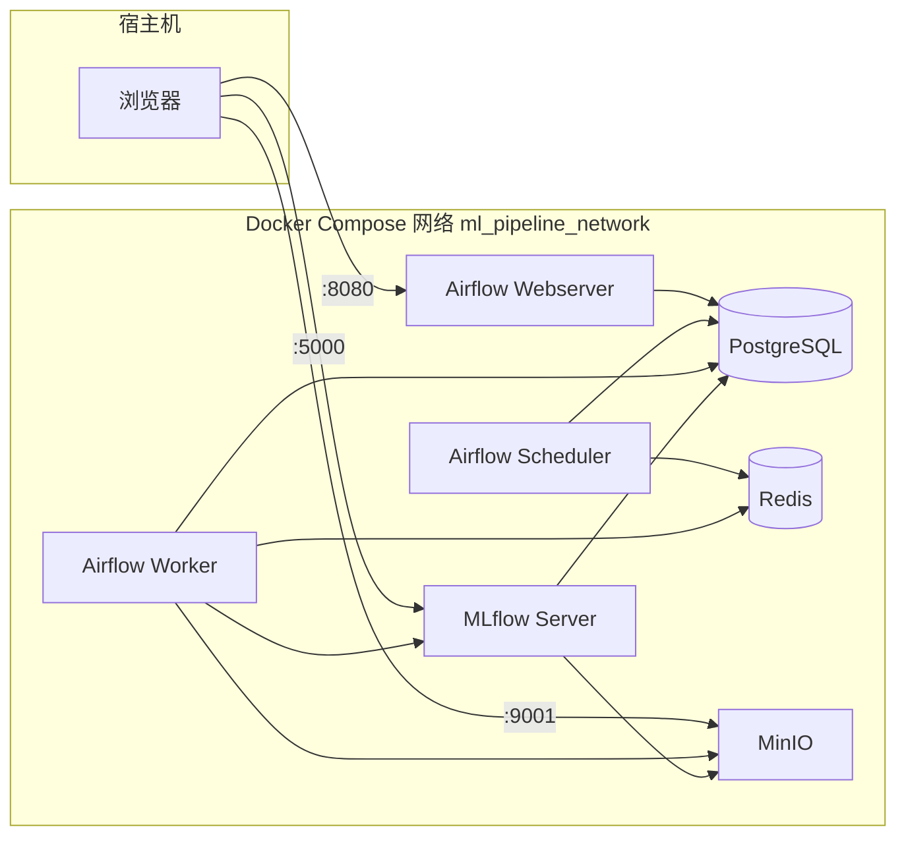
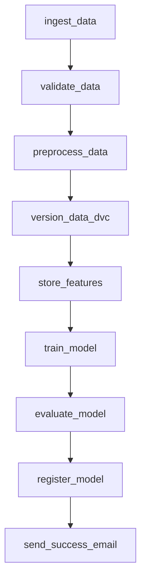
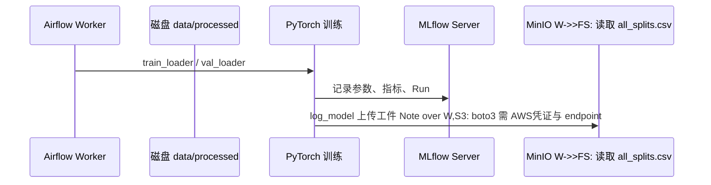

# 项目技术详解：栈、用法与关键点

本文面向 **本仓库的实现与运维**，说明用到的技术是什么、在项目中如何落地、以及集成时容易踩坑的地方。路径均相对于仓库根目录。

---

## 目录

1. [技术栈总览](#1-技术栈总览)
2. [系统架构与数据流（图）](#2-系统架构与数据流图)
3. [各技术在本项目中的运用](#3-各技术在本项目中的运用)
4. [关键配置与环境变量](#4-关键配置与环境变量)
5. [代码与目录速查](#5-代码与目录速查)
6. [常见问题与原则](#6-常见问题与原则)

---

## 1. 技术栈总览

| 技术 | 角色 | 在本项目中的主要落点 |
|------|------|----------------------|
| **Apache Airflow** | 工作流编排与调度 | `dags/ml_pipeline_dag.py` |
| **MLflow** | 实验跟踪、模型注册、工件存储 | `src/training.py`、`src/evaluation.py`；服务端 `docker-compose.yml` → `mlflow` |
| **PyTorch / torchvision** | 图像分类训练与评估 | `src/training.py`、`src/dataset.py`、`src/evaluation.py` |
| **PostgreSQL** | 关系型存储：MLflow 元数据、Airflow 元数据、特征表 | `docker-compose.yml` → `postgres`；`src/feature_store.py` |
| **MinIO** | S3 兼容对象存储（工件、大数据） | `docker-compose.yml` → `minio`；MLflow `--default-artifact-root s3://mlflow/` |
| **Redis** | Celery 消息代理 | `docker-compose.yml` → `redis` |
| **Docker / Compose** | 多服务一键拉起 | `docker-compose.yml`、`airflow/Dockerfile`、`mlflow/Dockerfile` |
| **DVC**（可选） | 数据/目录版本化 | DAG任务 `version_data_dvc`；需完整 `.dvc` + `.git` 挂载才在容器内可用 |
| **Pandas / scikit-learn** | 预处理与评估指标 | `src/preprocessing.py`、`src/evaluation.py` |
| **自研校验** | 数据质量门禁（类 GE 规则） | `src/data_validation.py` |

---

## 2. 系统架构与数据流（图）

### 2.1 服务拓扑（Docker Compose）

以下描述 **Compose 网络内** 的典型关系：宿主机通过端口映射访问 UI，容器之间用 **服务名**通信。



**关键点：** Worker 执行 `train_model` 时，会向 **MLflow REST** 写元数据、向 **MinIO（S3 API）** 上传模型工件；因此 Worker 容器内需配置与 MLflow 一致的 `AWS_*` 与 `MLFLOW_S3_ENDPOINT_URL`（见第 4 节）。

### 2.2 管道任务流（DAG）



**关键点：**

- **XCom**：下游依赖 `preprocess_data` 推送的 `all_splits_csv`；若仅重试下游，可能缺 XCom，DAG 内对磁盘路径有回退逻辑（见 `dags/ml_pipeline_dag.py` 中 `_get_all_splits_csv_path`）。
- **DVC**：在仅挂载 `dags/src/data` 而无 `.dvc/.git` 时，任务会 **跳过** 或失败；本地开发可把 DVC 当可选步骤。

### 2.3 训练阶段数据与 MLflow



---

## 3. 各技术在本项目中的运用

### 3.1 Apache Airflow

**是什么：** 用 DAG 定义任务依赖、调度、重试与监控；任务多为 `PythonOperator`，可传 **XCom** 在任务间传小数据或路径。

**在本项目中：**

- 入口：`dags/ml_pipeline_dag.py`。
- **项目根与导入路径**：通过 `_project_root()` 与 `sys.path` 把仓库根加入路径，从而 `import src.xxx` 在 Worker 中可用。
- **Celery Worker限制**：子进程为 *daemon*，**不能**在任务里使用 `DataLoader(num_workers > 0)` 再 fork worker；DAG 中已改为 `num_workers=0`、`pin_memory=False`。

**关键点：**

- 改 DAG 后若挂载卷生效，一般 **无需重建镜像**；改 `airflow/Dockerfile` 则需 `build`。
- 邮件任务已改为日志通知，避免未配 SMTP 时最后一步失败（可按需改回 `EmailOperator`）。

---

### 3.2 MLflow

**是什么：** Tracking（实验/Run/指标/参数）、Artifacts（模型与文件）、Model Registry（模型版本与阶段）。

**在本项目中：**

- 客户端：`src/training.py` 中 `MLflowTracker`、`mlflow.pytorch.log_model`等。
- 服务端：`docker-compose.yml` 中 `mlflow` 服务，`--backend-store-uri` 指向 Postgres，`--default-artifact-root` 指向 `s3://mlflow/`（MinIO）。
- **Host 头校验**（较新版本）：服务端需 `--allowed-hosts` 或 `MLFLOW_SERVER_ALLOWED_HOSTS`，否则容器间用 `http://mlflow:5000` 访问会 **403 DNS rebinding**。

**关键点：**

- **Airflow Worker** 与 **MLflow Server** 是不同容器：Tracking URI 在 Compose 内通常为 `http://mlflow:5000`。
- **上传工件**时，Worker 内 **boto3** 需要 `AWS_ACCESS_KEY_ID`、`AWS_SECRET_ACCESS_KEY`、`MLFLOW_S3_ENDPOINT_URL`（或等价配置），否则会 `NoCredentialsError`。

---

### 3.3 PyTorch与数据管道

**是什么：** `torch`/`torchvision` 负责 ResNet 等模型与图像 `Dataset`/`DataLoader`。

**在本项目中：**

- `src/dataset.py`：`ImageClassificationDataset`、`create_data_loaders`，从 `all_splits.csv` 按 `split` 列划分 train/val/test。
- `src/training.py`：训练循环、早停、保存 `best_model.pth`、MLflow 记录。
- `src/preprocessing.py`：生成 `train.csv` / `val.csv` / `test.csv` 及合并的 **`all_splits.csv`**（供 DataLoader 使用）。

**关键点：**

- 图像路径在 CSV 中多为相对路径，`root_dir` 传 **项目根**（Docker 下即 `ML_PIPELINE_PROJECT_ROOT`对应目录）。
- Airflow 任务中 **务必** `num_workers=0`，避免 daemon 进程嵌套子进程报错。

---

### 3.4 PostgreSQL 与特征存储

**是什么：** 关系库；本项目中既存 **MLflow 的实验元数据**（由 MLflow Server 写入），也存 **自定义特征表**（`FeatureStore`）。

**在本项目中：**

- `src/feature_store.py`：连接 Postgres，建表、批量写入简化特征向量（示例为随机向量 + 标签）。
- DAG `store_features`：从 `all_splits.csv` 取 `split==train` 子集写入库。
- Compose 默认库用户与库名多为 `mlflow`/`mlflow`，特征表与 MLflow 元数据可 **共用同一数据库**（不同表），简化本地部署。

**关键点：**

- 在 **容器内** 连数据库应使用主机名 **`postgres`**，而不是 `localhost`（`localhost` 指向当前容器自身）。DAG 中 `_feature_store_postgres_host()` 对 Docker 做了默认处理。

---

### 3.5 MinIO（S3）

**是什么：** 与 AWS S3 API 兼容的对象存储，适合私有云或本地开发。

**在本项目中：**

- MLflow 将 Run 的 **大工件**（如模型目录）存到 `s3://mlflow/...`，实际后端为 MinIO。
- 首次使用需在 MinIO 控制台 **创建名为 `mlflow` 的 bucket**（与 `docker-compose` 文末说明一致）。

**关键点：**

- **谁上传工件？** 运行 `mlflow.pytorch.log_model` 的进程（常为 Airflow Worker）会直接调 S3 API，因此 **Worker必须带 MinIO 凭证**，不能只配在 `mlflow` 容器上。

---

### 3.6 Redis

**是什么：**轻量消息代理；Airflow **CeleryExecutor** 用其分发任务。

**在本项目中：**

- `docker-compose.yml` 中 `AIRFLOW__CELERY__BROKER_URL` 指向 `redis://redis:6379/0`。

**关键点：**

- 与业务训练逻辑无直接耦合；Executor 从 Local 改为 Celery 时必须同时起 **redis + worker**。

---

### 3.7 Docker Compose

**是什么：** 声明多容器应用，统一网络与依赖顺序（`depends_on` + `healthcheck`）。

**在本项目中：**

- 一次拉起 Postgres、MinIO、MLflow、Redis、Airflow Web/Scheduler/Worker。
- Airflow 服务挂载 `./dags`、`./src`、`./data` 等，便于热更新代码。

**关键点：**

- 修改 **环境变量**（如 MinIO 凭证）后需 **`docker compose up -d` 重建/重启** 对应服务，否则旧容器仍用旧 env。

---

### 3.8 DVC（可选）

**是什么：** 用 Git 跟踪数据 **指针文件**（`.dvc`），大文件存远程（可对接 S3/MinIO）。

**在本项目中：**

- DAG 任务 `version_data_dvc` 在仓库根执行 `dvc add data/processed` 等。
- 若容器内 **没有** `.dvc` / `.git`，任务会 **跳过** 或失败（视实现而定）；完整 DVC 建议在 **宿主机** 或挂载整个仓库根的容器中执行。

**关键点：**

- DVC 与 Airflow 集成时，要同时解决 **仓库元数据挂载** 与 **CI 身份**，否则容易变成“只在笔记本上能跑”。

---

## 4. 关键配置与环境变量

下表汇总 **与本项目 DAG/训练最相关** 的变量（具体以当前 `docker-compose.yml` 为准）。

| 变量 | 作用 |
|------|------|
| `ML_PIPELINE_PROJECT_ROOT` | 项目根（Docker 常为 `/opt/airflow`） |
| `MLFLOW_TRACKING_URI` | MLflow 跟踪地址（容器内常用 `http://mlflow:5000`） |
| `MLFLOW_S3_ENDPOINT_URL` | MinIO S3 API（如 `http://minio:9000`） |
| `AWS_ACCESS_KEY_ID` / `AWS_SECRET_ACCESS_KEY` | 上传工件到 MinIO；**Worker 必须配置** |
| `FEATURE_STORE_POSTGRES_HOST` 等 | 特征库连接；不设置时 DAG 对 Docker 默认 `postgres` |
| `MLFLOW_SERVER_ALLOWED_HOSTS` / `--allowed-hosts` | 放行 `Host: mlflow` 等，避免 403 |

**Dockerfile 与 Python 版本：** Airflow 镜像多为 Python 3.8；MLflow 镜像可能为 3.11。客户端与服务端 API 需兼容，一般同一主版本 MLflow 即可。

---

## 5. 代码与目录速查

| 路径 | 说明 |
|------|------|
| `dags/ml_pipeline_dag.py` | DAG、XCom、环境探测、任务入口 |
| `src/data_ingestion.py` | 摄取与 `raw_dataset.csv` |
| `src/data_validation.py` | 校验与 `data/validation/validation_report.json` |
| `src/preprocessing.py` |预处理与 `all_splits.csv` |
| `src/feature_store.py` | Postgres 特征表 |
| `src/dataset.py` | DataLoader；注意 `num_workers` |
| `src/training.py` | 训练与 MLflow 记录 |
| `src/evaluation.py` | 测试集评估 |
| `docker-compose.yml` | 全栈服务与环境变量 |
| `airflow/Dockerfile` | Worker 依赖（含 `mlflow`、`torch` 等） |

**配置推导示例（项目根）：**

```python
# 摘自 dags/ml_pipeline_dag.py（逻辑示意）
def _project_root() -> Path:
    env = os.environ.get("ML_PIPELINE_PROJECT_ROOT")
    if env:
        return Path(env).expanduser().resolve()
    return Path(__file__).resolve().parent.parent
```

---

## 6. 常见问题与原则

1. **容器内 `localhost`：**指向本容器；访问 Postgres / MLflow / MinIO 应使用 **服务名**（`postgres`、`mlflow`、`minio`）。
2. **MLflow 403 Host：** 在 MLflow Server 配置 `allowed-hosts`，包含 `mlflow` 及带端口形式（若你的版本需要）。
3. **NoCredentialsError：** 在 **执行 `log_model` 的容器**（Airflow Worker）配置 `AWS_*` 与 `MLFLOW_S3_ENDPOINT_URL`。
4. **DataLoader daemon：** Airflow Celery 任务中 `num_workers=0`。
5. **XCom 与重试：** 只重试下游时可能缺少新 key；依赖磁盘回退或 Clear 上游任务后重跑。
6. **DVC：** 容器内无完整 Git/DVC 元数据时不要强依赖该任务；在 CI/本地做数据版本化亦可。

---

## 附录：延伸阅读

- 仓库根目录 [`README.md`](../../README.md) — 开发者上手与目录说明  
- [`architecture.md`](../../architecture.md) — 设计长文  
- [`requirements.md`](../../requirements.md) — 课程/需求清单  

如需把本文中的 Mermaid 图导出为 PNG，可使用 VS Code 插件、或 CI 中 `mmdc` 等工具渲染 `result_img/` 下图片并在根 `README` 引用。
